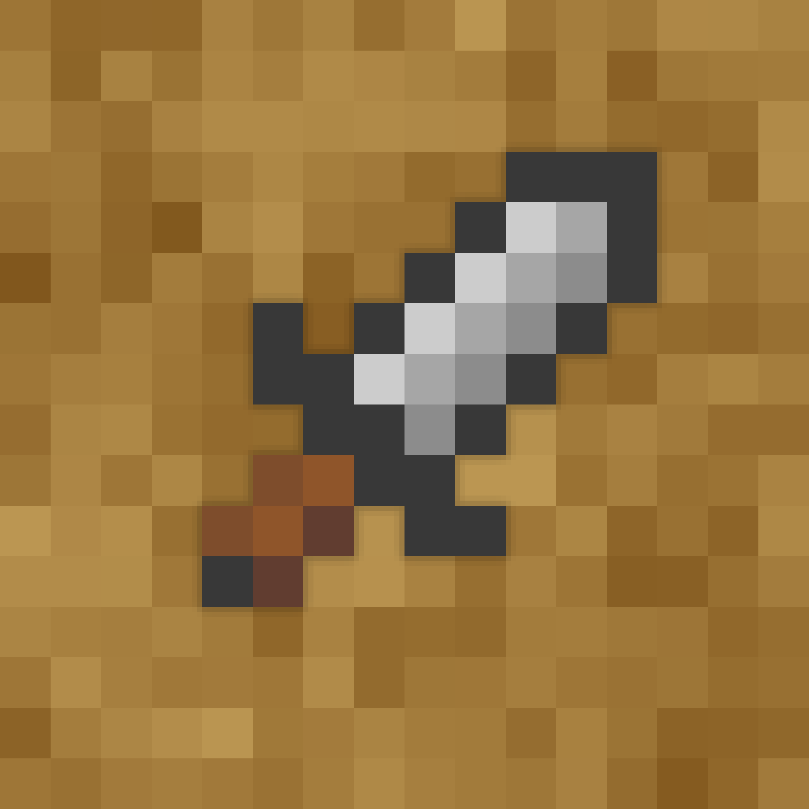

[license]: LICENSE
[license-shield]: https://img.shields.io/badge/License-MIT-yellow.svg
[release]: https://github.com/BurrowStudios/gatekeeper/releases
[release-shield]: https://img.shields.io/github/release/BurrowStudios/gatekeeper.svg

[ ![license-shield][] ][license]
[ ![release-shield][] ][release]

# Gatekeeper

A permission service backend for Burrow Studios.

This service tracks entity ids and their associated permission overrides. It is built from the ground up to be
integrated into the [Burrow Studios architecture](https://github.com/BurrowStudios/api-docs), though the RESTful API can
also be used as a standalone service.

### ⚠️ Early development notice ⚠️

Please note that this application is still in early development and not officially supported until the first release.
